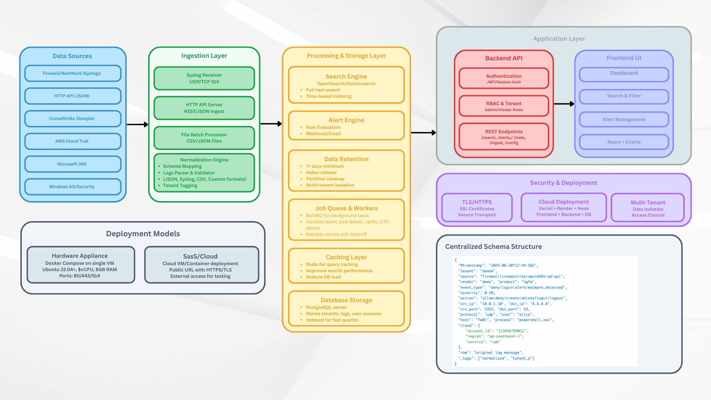
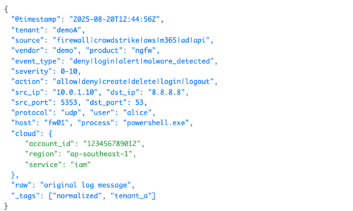

# LMS (Log Management System) Architecture

## 📑 Table of Contents
- [System Overview](#system-overview)  
- [Architecture Diagram](#architecture-diagram)  
- [Component Details](#component-details)  
- [Data Flow](#data-flow)  
- [Tenant Model](#tenant-model)  
- [User Process Flows](#user-process-flows)  
- [Admin Process Flows](#admin-process-flows)  
- [Technology Stack](#technology-stack)  
  - [Backend Technologies](#backend-technologies)  
  - [Frontend Technologies](#frontend-technologies)  
  - [Infrastructure & Deployment](#infrastructure--deployment)  
  - [Development Tools](#development-tools)  
- [Performance Considerations](#performance-considerations)  
- [Security Measures](#security-measures)  
- [Additional Resources](#additional-resources)  

---

## System Overview

The Log Management System (LMS) is a multi-tenant SaaS platform designed to collect, process, store, and analyze log data from various sources. The system provides real-time log ingestion, powerful search capabilities, customizable dashboards, and intelligent alerting mechanisms.

### Key Features
- **Multi-tenant Architecture**: Secure data isolation between organizations
- **Real-time Log Ingestion**: Support for multiple log formats and protocols
- **Advanced Search**: Full-text search with filtering and aggregation
- **Custom Dashboards**: Interactive visualizations and metrics
- **Intelligent Alerting**: Rule-based notifications with multiple channels
- **Role-based Access Control**: Granular permissions management

## Architecture Diagram



## Component Details

### 1. Data Sources
This system can collect logs from multiple sources such as firewalls, networks, HTTP APIs, CrowdStrike, AWS CloudTrail, Microsoft 365, and Active Directory. This flexibility ensures that both security and application events can be centralized into one platform.

### 2. Ingestion Layer
The ingestion layer has three main entry points: a Syslog receiver for UDP/TCP logs, an HTTP API for JSON logs, and a file batch processor for CSV or JSON files (Note: CSV ingestion is planned but not yet implemented only JSON is supported). Logs go through a normalization engine which maps fields into a unified schema, validates formats, and tags them with the correct tenant.

### 3. Processing & Storage Layer
- **Search Engine**: Logs are indexed to support fast full-text search and time-based queries.
- **Alert Engine**: Rules are continuously evaluated, and alerts are sent via email or webhook if thresholds are met.
- **Data Retention**: Logs are automatically cleaned up after seven days to save storage and enforce isolation per tenant.
- **Job Queue & Workers**: BullMQ handles background tasks such as sending emails, refreshing cache, OTP delivery, and running alert jobs with reliable retries.
- **Caching Layer**: Redis is used for query caching, which reduces load on the database and improves performance.
- **Database Storage**: PostgreSQL stores the main application data such as logs, tenants, and user sessions, with indexes for efficient queries.

### 4. Application Layer
- **Backend API**: The backend API handles authentication using JWT, applies RBAC rules for Admin and Viewer roles, and exposes REST endpoints for search, alert management, and log ingestion.
- **Frontend**: The React frontend provides dashboards, search and filter tools, alert management, and chart visualizations for easy analysis.

### 5.  Security & Deployment
Security is enforced through HTTPS/TLS with SSL certificates, and role-based access ensures tenants are isolated. Deployment is flexible, run it as a cloud SaaS setup using Vercel, Render, or Neon, or as a single-node appliance if needed.

### 6.  Deployment Models
There are two main deployment models. The first is a hardware appliance with Docker Compose on a VM. The second is a SaaS or cloud-based deployment, where the system is hosted on a cloud provider with HTTPS access for external testing.

### 7.  Centralized Schema Structure

All logs are normalized into a common schema with fields such as timestamp, tenant, source, severity, action, user, and IPs. This unified structure allows consistent search, alerting, and visualization across different log sources.

## Data Flow

### 1. Log Ingestion Flow
```
Log Source → Ingestion Layer → Queue → Background Workers → Database
```

1. **Input**: Logs arrive via various channels (syslog, HTTP, file upload)
2. **Validation**: Format validation and basic parsing
3. **Queuing**: Logs queued for background processing
4. **Processing**: Workers parse, enrich, and route logs to appropriate tenant
5. **Storage**: Processed logs stored in PostgreSQL with proper indexing

### 2. Search & Retrieval Flow
```
User Query → Cache Check → Database Query → Results Processing → Response
```

1. **Query**: User submits search query through frontend
2. **Cache**: Check Redis for cached results
3. **Database**: Query PostgreSQL with optimized indexes
4. **Processing**: Format and aggregate results
5. **Response**: Return infinte scrolling results

### 3. Alerting Flow
```
Log Processing → Rule Evaluation → Alert Trigger → Notification Dispatch
```

1. **Rule Evaluation**: Each log checked against tenant's alert rules
2. **Trigger**: Matching conditions trigger alert creation
3. **Rate Limiting**: Prevent spam with configurable limits
4. **Dispatch**: Send notifications via configured channels

---

## Tenant Model

The LMS uses a **shared database with tenant isolation**:  

- Every table includes a `tenant` field  
- Logs, users, and alerts are always stored with tenant IDs  
- **Row-level security** and **application filters** ensure users only access their own tenant’s data  
- Admins can view all tenants, while standard users (VIEWER) only see their own  

### Prisma Schema (Tenant-Aware Models)
- **User**: Linked to tenant, with role (ADMIN/USER) and status  
- **Log**: Contains `tenant`, metadata fields, severity, and raw JSON  
- **AlertRule**: Configurable per tenant, unique by name within a tenant  
- **Alert**: Stores triggered alerts with tenant and rule reference  

---

## User Process Flows

### User Registration & Onboarding
```
1. Sign Up → 2. Email Verification → 3. Organization Setup → 4. Profile Complete → 5. Dashboard Access
```

### Log Search Process
```
1. Login → 2. Select Time Range → 3. Enter Search Query → 4. Apply Filters → 5. View Results
```

### Alert Configuration
```
1. Go to Alerts → 2. Create Rule → 3. Define Conditions → 4. Set Notifications → 5. Test & Activate
```

## Admin Process Flows

### Organization Management
```
1. Platform Access → 2. Tenant List → 3. Select Organization → 4. Manage Settings/Users → 5. Monitor Usage
```

### User Management
```
1. Admin Panel → 2. User List → 3. Add/Edit User → 4. Assign Roles & Status
```

### System Monitoring
```
1. Admin Dashboard → 2. System Metrics → 3. Performance Analysis → 4. Issue Resolution → 5. Optimization
```

---

## Technology Stack

### Backend Technologies
| Component | Technology | Purpose |
|-----------|------------|---------|
| **Runtime** | Node.js | Efficient event-driven runtime for handling high log ingestion and concurrent API requests. |
| **Framework** | Express | Flexible web framework for building REST APIs with middleware support. |
| **Database** | PostgreSQL | Reliable relational DB supporting indexing and partitioning, ideal for log-heavy workloads. |
| **Cache** | Redis | Used for session caching, fast searches, and storing rate-limiting data. |
| **Queue** | BullMQ | Handles background jobs (alerts, emails, OTP) with retries and backoff. |
| **Auth** | JWT | Stateless token authentication with RBAC enforcement. |
| **ORM** | Prisma | Type-safe ORM with migrations and tenant-aware querying. |

### Frontend Technologies
| Component | Technology | Purpose |
|-----------|------------|---------|
| **Framework** | React | UI library chosen for dashboards and real-time search features. |
| **Styling** | TailwindCSS | Utility-first CSS framework for rapid, responsive UI design. |
| **shadcn/ui** | shadcn | Prebuilt components styled with Tailwind for consistent UI. |
| **State Management** | Zustand | Lightweight global state manager for auth and filters. |
| **Routing** | React Router | Handles navigation and data fetching for app routes. |
| **Data Caching** | TanStack Query | Caches API responses and keeps frontend data fresh. |
| **Charts** | Recharts | Used for visual dashboards like severity distribution and log trends. |
| **HTTP Client** | Axios | Simplifies API requests with interceptors for auth tokens. |

### Infrastructure & Deployment
| Component | Service | Purpose |
|-----------|---------|---------|
| **Backend Hosting** | Render | Deploys the backend API with scaling support. |
| **Frontend Hosting** | Vercel | Optimized React hosting with global CDN. |
| **Database Hosting** | Neon | Serverless PostgreSQL with autoscaling. |
| **Cache Hosting** | Redis Cloud | Manages caching and background jobs. |
| **Email Service** | Resend | Provides reliable delivery for OTPs and alerts. |

### Development Tools
| Tool | Technology | Purpose |
|------|------------|---------|
| **Language** | TypeScript | Provides static typing for safety and maintainability. |
| **Testing** | Jest | Unit and integration testing framework. |
| **API Testing** | Supertest | Automated endpoint testing for APIs. |
| **Linting** | ESLint | Enforces coding standards and prevents errors. |
| **Formatting** | Prettier | Ensures consistent code formatting. |
| **Version Control** | Git | Source control for team collaboration. |
| **Repository** | GitHub | Hosts code, issues, and documentation. |

---

## Performance Considerations

### Database Optimization
- Partitioned tables for large log volumes  
- Strategic indexes on common queries  
- Connection pooling for concurrency  
- Optimized SQL queries with execution plans  

### Caching Strategy
- Redis session management  
- Query result caching  
- Dashboard caching  
- Rate limiting storage  

### Scalability Features
- Horizontal scaling with load balancers  
- PostgreSQL read replicas for heavy queries  
- Background jobs for heavy processing  
- Microservice-ready architecture  

---

## Security Measures

### Data Protection
- TLS encryption for data in transit  
- Secure password hashing (bcrypt)  
- SQL injection prevention  
- XSS protection with sanitization  

### Access Control
- Role-based permissions (Admin/Viewer)  
- API rate limiting per tenant  
- Session timeout and rotation  
- Multi-factor authentication *(planned)*  

---

## Additional Resources
- [Setup Guide](./setup_saas.md)  
- [API Documentation](../backend/README.md)  
- [Frontend Guide](../frontend/README.md)  
- [Sample Scripts](../samples/README.md)  