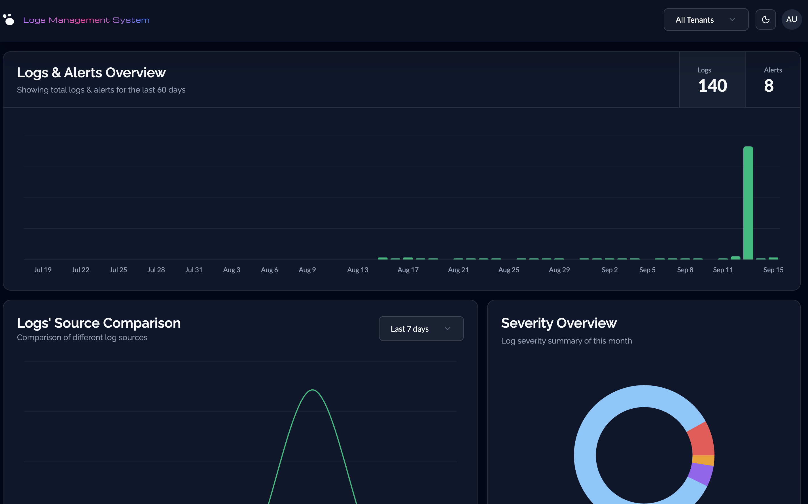

# LMS Frontend (React + Vite)

The **frontend** of the Log Management System (LMS), built with **React + Vite + TypeScript**.  
It provides a responsive dashboard, search and filtering tools, alert management, authentication flows, and reusable UI components.  
The frontend is designed with a strong focus on **clean code, performance optimization, reusability, and developer experience**.

---

# Previews

## Login Page


## Logs Dashboard Page



## Management Page


---

## 📑 Table of Contents
- [Features](#features)
- [Tech Stack](#tech-stack)
- [Folder Structure](#folder-structure)
- [Environment Variables](#environment-variables)
- [Scripts](#scripts)
- [Run Locally](#run-locally)

---

## Features
- **Authentication**: Login, registration, OTP verification, password reset  
- **Dashboard**: View logs, search, filter, visualize with charts  
- **Alert Management**: Create, update, delete, and monitor alerts  
- **Reusable Components**: Built with shadcn/ui + Tailwind for clean UI  
- **Global State**: Zustand store for user and filters  
- **Data Fetching**: React Router actions/loaders + TanStack Query for caching  
- **Validation**: Zod schemas with React Hook Form  
- **Optimized DX**: Modular, reusable, and performant architecture  

---

## Tech Stack

### Core
- **React 19 + Vite** → Lightning-fast development and build tool  
- **TypeScript** → Type safety and maintainability  
- **React Router v7** → Routing, loaders, and actions for data fetching + form submission  
- **TanStack Query** → Data fetching, caching, and syncing with backend APIs  
- **Zustand** → Lightweight global state management  
- **Zod + React Hook Form** → Form validation and schema enforcement  
- **Axios** → HTTP client with custom API instances (Admin, Auth, User)  
- **TailwindCSS + shadcn/ui** → Styling and prebuilt UI components  
- **Recharts** → Visualizations for logs and alerts  

### Dev Tools
- **Vite** → Local dev + build system  
- **ESLint + Prettier** → Linting and formatting  
- **TypeScript ESLint** → Strong typing rules  
- **tw-animate-css** → Animations with Tailwind  

---

## Folder Structure

```
frontend/
├─ public/                 # Static assets
├─ src/
│  ├─ api/                 # Axios instances and TanStack Query configs/queries
│  ├─ assets/              # Images, lottie files, previews, etc.
│  ├─ components/          # High-level reusable components (auth, charts, modals, ui, tables, shared)
│  ├─ hooks/               # Reusable hooks (forms, queries, error handling, etc.)
│  ├─ lib/                 # Constants, utils, zod validators
│  ├─ pages/               # App pages (auth, dashboard, not-found)
│  ├─ router/              # React Router actions and loaders
│  ├─ store/               # Zustand stores (filter-store, user-store)
│  ├─ types/               # Global TypeScript types
│  ├─ index.css            # Global styles
│  ├─ main.tsx             # Entry point
│  ├─ routes.tsx           # Router definitions
│  └─ vite-env.d.ts        # Vite + TS env definitions
└─ package.json
```

---

## Environment Variables

The frontend expects environment variables for configuration (set in `.env`):

```env
VITE_API_URL=https://your-backend-api-url
```

---

## Scripts

| Script | Description |
|--------|-------------|
| `npm run dev` | Start local dev server (Vite) |
| `npm run build` | Build production-ready static files |
| `npm run preview` | Preview production build locally |
| `npm run lint` | Run ESLint to check code style |

---

## Run Locally

1. Install dependencies:
   ```bash
   npm install
   ```
2. Start development server:
   ```bash
   npm run dev
   ```
3. Open the app at [http://localhost:5173](http://localhost:5173)

---

## Notes

- Designed with **reusability and clean code principles** to optimize both performance and developer experience.  
- Uses **modular architecture**: shared components, stores, and hooks are generic and easy to extend.  
- **Responsive UI** powered by Tailwind + shadcn ensures consistent design across devices.  
